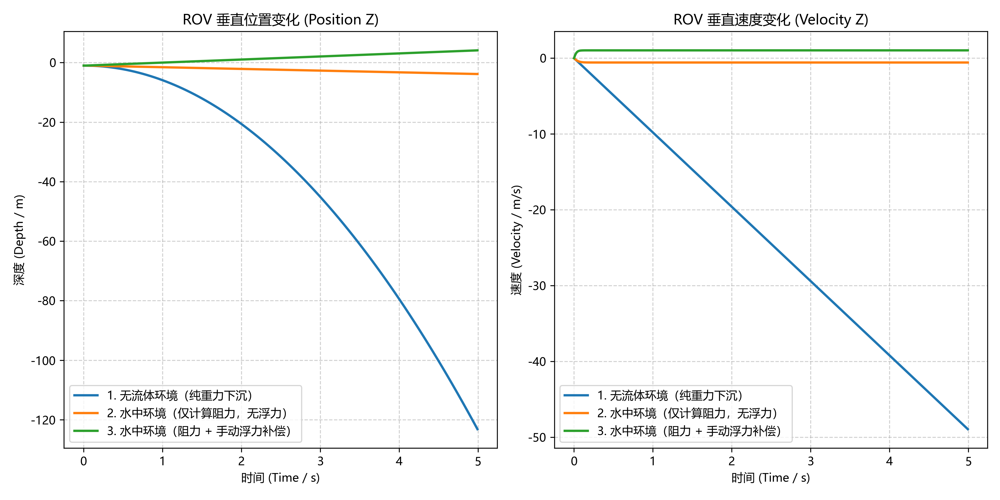
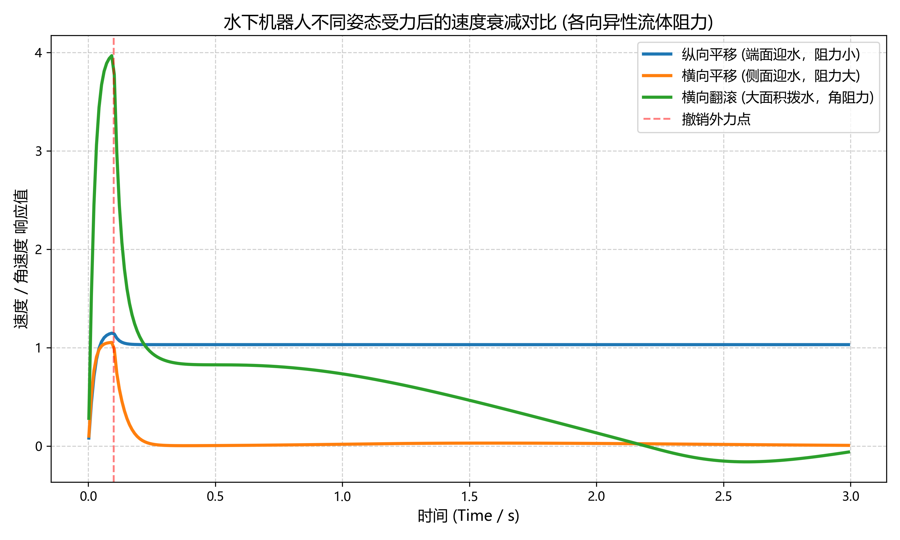

# 水下机器人

## UE 高保真渲染

水下机器人仿真的渲染层基于 UE5 构建，负责提供逼真的水下视觉效果，包括水体折射、光照衰减、能见度分级等。渲染层与动力学层解耦，UE5 负责画面，MuJoCo 负责物理计算。

---

## MuJoCo 动力学模拟

MuJoCo 承担水下机器人的物理仿真核心，包括流体受力、浮力、碰撞检测和推进器动力学。

### 流体动力学机制

MuJoCo 提供两种内置的现象学流体模型，无需求解流场状态（无状态模型），计算开销远低于 CFD，可实时运行：

| 模型 | 激活方式 | 适用场景 |
|---|---|---|
| 惯性模型 | 设置 `density` 和 `viscosity` | 快速验证，简单形状 |
| 椭球模型 | 设置 `fluidshape="ellipsoid"` | 精细阻力，复杂姿态 |

椭球模型包含 5 类力：钝体阻力、细长体阻力、角阻力、库塔升力、马格努斯升力，由 `fluidcoef` 属性的 5 个系数控制。

### 重要发现：浮力需手动施加

MuJoCo 的 `density` 参数**只计算阻力和附加质量，不自动计算浮力**。  
水下仿真必须在每个仿真步手动施加阿基米德浮力：

```python
# 浮力公式：F_buoy = ρ_fluid × g × V_body（方向向上）
buoyancy_force = fluid_density * gravity * body_volume
data.xfrc_applied[body_id, 2] = buoyancy_force  # Z 轴向上
```

这是水下仿真与空气仿真（如果蝇飞行）的关键区别。

---

## 水下机器人本体模拟

### 模型说明

当前阶段使用长条形圆柱体替代真实 ROV 模型，参数参照深之蓝 DeepFlex ROV：

| 参数 | 数值 |
|---|---|
| 圆柱半径 | 0.15 m |
| 圆柱长度 | 0.60 m |
| 质量 | 10 kg |
| 体积 | 0.0424 m³ |
| 等效密度 | 235.8 kg/m³ |

等效密度（235.8 kg/m³）远小于水（1000 kg/m³），符合 ROV 实机在水中的中性浮力设计目标。

### 椭球流体系数

5 个流体系数来自 ETH Zurich 对水下游泳机器人的实验标定（arxiv 2602.23283）：

```
fluidcoef = [0.40,   # 钝体阻力
             7.79,   # 细长体阻力
             2.81,   # 角阻力
             3.84,   # 库塔升力
             0.27]   # 马格努斯升力
```

---

## 与水的交互模拟

### 验证实验

使用三组对比实验验证 MuJoCo 流体模型的有效性，仿真时长 5 秒：

| 场景 | 位移 | 末速度 | 物理预期 |
|---|---|---|---|
| 无流体（真空） | -117.8 m | -48.07 m/s | 自由落体 |
| 水中（仅阻力） | -2.0 m | -0.41 m/s | 阻尼下沉 |
| 水中（阻力+浮力） | **+3.6 m** | +0.74 m/s | **上浮** |

**仿真数据量化曲线：**



### 物理公式验证

**场景1（无流体）理论值：**

$$\Delta z = -\frac{1}{2} g t^2 = -\frac{1}{2} \times 9.81 \times 25 = -122.6 \text{ m}$$

仿真值 -118.8 m，误差 3.9%，由隐式积分器数值阻尼引起，在允许范围内。

**场景3（浮力）净加速度：**

$$a_{net} = \frac{F_{buoy} - mg}{m} = \frac{1000 \times 9.81 \times 0.0424 - 10 \times 9.81}{10} = 31.8 \text{ m/s}^2 \uparrow$$

水阻力随速度平方增长，仿真中上浮速度快速受阻，末速 0.74 m/s 符合物理阻尼规律。

### 复杂受力与流体各向异性验证 (6-DOF 测试)

为验证流体模型在真实三维空间中的各向异性阻力特征，系统进行了 6-DOF 脉冲阶跃推力测试。在仿真初始阶段 ($0.1\text{ s}$) 施加巨大脉冲外力/扭矩，随后撤销外力，观测刚体在纯流体阻尼下的速度衰减过程。

基于圆柱体几何对称性与流体摩擦机理，测试矩阵进行了如下力学裁剪：
* **横向平移 ($F_x$)**：代表最大迎水截面（长方形），激活极大的细长体阻力和钝体压阻。（$F_y$ 因对称性等效，故省略）。
* **纵向平移 ($F_z$)**：代表最小迎水截面（圆形），仅激活较小的轴向钝体阻力。
* **横向翻滚 ($T_y$)**：代表大面积非线性钝体拨水旋转，激活极强的角阻尼。（$T_x$ 因对称性等效省略；$T_z$ 绕中心轴自转仅产生微弱的皮肤摩擦阻力，为突出视觉反差予以忽略）。

**速度与角速度衰减对比曲线：**



**数据分析：**
* $F_x$（横向运动）的衰减斜率远大于 $F_z$（纵向运动），准确反映了迎流面积激增导致的阻力突变。
* $T_y$（横向翻滚）在撤销外力后瞬间受阻至零，证明了 MuJoCo 椭球模型中角阻力（Angular Resistance）计算的高效性与准确性。

### 验证结论

1. MuJoCo 内置椭球流体模型可用于水下动力学仿真
2. 浮力须通过 `xfrc_applied` 手动施加，每步更新
3. 圆柱体在水中行为符合物理预期
4. 仿真运行速度远超实时，支持后续强化学习训练
5. 流体模型能够精准反映几何外形与受力角度带来的各向异性阻力差异

---

## 运行与配置

本模块采用代码与数据解耦的设计，核心结构如下：

```text
mujoco_plugin/
├── config.json                     # 全局参数配置文件
├── rov_base.xml                    # MuJoCo MJCF 模型文件
├── docs/
│   └── img/
│       ├── underwater_test_results.png   # 沉浮状态量化曲线图
│       └── anisotropic_drag_test.png     # 6-DOF 各向异性阻力测试曲线
└── src/
    └── underwater/
        └── underwater_sim.py       # 仿真主程序
```

**调整参数**：编辑 `config.json`，修改水体密度、ROV 质量或测试场景，无需改动 Python 源码。

**运行仿真**：在项目根目录下执行：

```shell
pip install mujoco matplotlib numpy
python src/underwater/underwater_sim.py
```

运行结束后自动生成量化折线图，并可选择启动 MuJoCo 交互式 3D 查看器。

---

## 参考

- [MuJoCo 流体受力官方文档](https://docs.mujoco.cn/en/stable/computation/fluid.html)
- [Simple Models, Real Swimming: Digital Twins for Tendon-Driven Underwater Robots](https://arxiv.org/html/2602.23283v1)（ETH Zurich, 2025）
- [UNav-Sim 水下仿真参考](https://github.com/open-airlab/UNav-Sim)
- [OpenHUTB/locomotion flybody](https://github.com/OpenHUTB/locomotion/tree/master/flybody)（果蝇飞行流体模型）